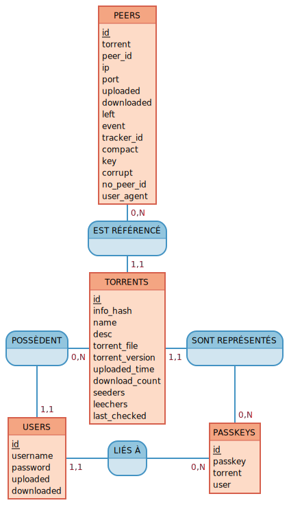

<h1>hestia-database</h1>

hestia-database is the module allowing the Hestia tracker to consult, add, change or delete information in the database.

hestia-database is based on a REST (Representational state transfer) interface model.

 

<h1>
    Entity–relationship model (MCD)
</h1>

    

