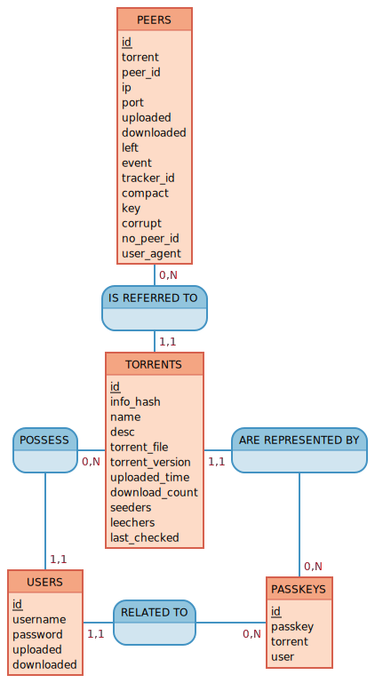

<h1>hestia-database</h1>

hestia-database est le module permettant au tracker Hestia de consulter, ajouter, changer ou encore supprimer des informations dans la base de données.

hestia-database repose sur un modèle d'interface de type REST (Representational state transfer).

 

<h1>
    Modèle entité-association (MCD)
</h1>

    

